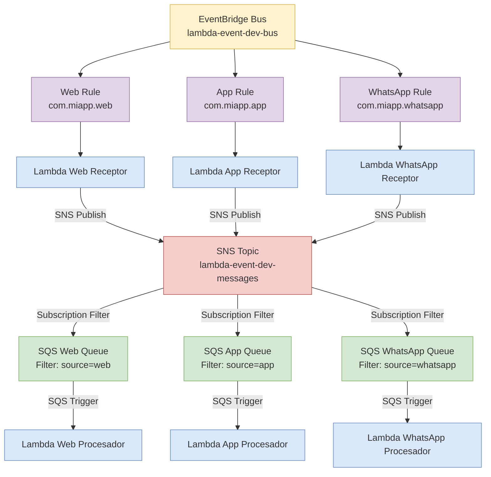

# Lambda Event Architecture - Mermaid Diagram

## Patrones Implementados:

1. **Publish/Subscribe** (Principal)
2. **Fan-out** (SNS → múltiples SQS)
3. **Event Notification** (eventos livianos)

## Servicios AWS:
- 1 EventBridge Bus
- 3 EventBridge Rules
- 6 Lambda Functions
- 1 SNS Topic
- 3 SQS Queues
- 2 IAM Roles